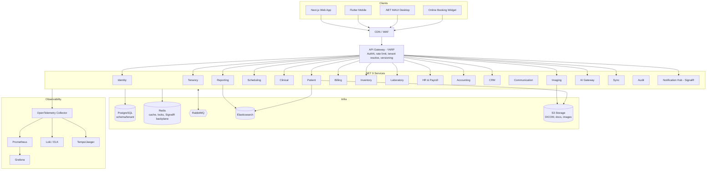
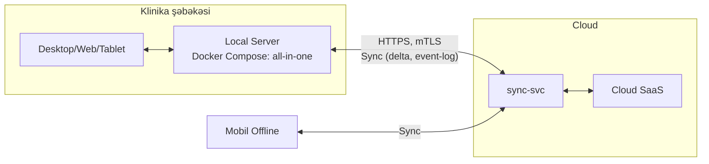
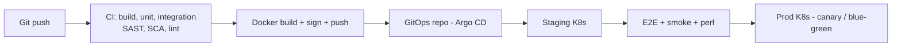

# Mərhələ 1 — System Architecture

> Status: ✅ Tamamlandı. Növbəti: Mərhələ 2 (Database Design / ER)

## 1. Arxitektura prinsipləri

1. **Modular Monolith → Microservices təkamülü.** Hər Bounded Context müstəqil deploy edilə bilən vahid kimi yazılır (öz DB sxemi, öz API, yalnız events/contracts ilə əlaqə). Başlanğıcda bir neçə "deployable"-da qruplaşdırılır, trafikə görə ayrılır.
2. **Clean Architecture** (hər servisdə): `Domain ← Application ← Infrastructure ← API`. Asılılıq yalnız içəriyə.
3. **DDD:** Aggregate, Value Object, Domain Event, Repository, Specification.
4. **CQRS:** Command (yazı, PostgreSQL) / Query (oxu, optimallaşdırılmış read model, Redis/Elasticsearch).
5. **Event-driven:** RabbitMQ + **Transactional Outbox / Inbox** (exactly-once effekt).
6. **Offline-first** klientlər üçün sync qatı.
7. **Security by design**, **Observability by default**.

## 2. Yüksək səviyyəli diaqram (C4 — Container)



## 3. Servis kataloqu və deployable qruplaşma

| Deployable | Daxil olan context-lər | Niyə birlikdə (başlanğıc) | Ayrılma meyarı |
|---|---|---|---|
| `identity-svc` | Identity, Tenancy | Auth izolasiyası, təhlükəsizlik sərhədi | Həmişə ayrı |
| `clinic-core-svc` | Patient, Scheduling, Clinical | Sıx əlaqəli, ortaq tranzaksiya | Scheduling yük > həddi |
| `billing-svc` | Billing, Accounting | Maliyyə konsistensiyası | Həmişə ayrı (audit) |
| `inventory-svc` | Inventory, Laboratory | Material/sifariş axını | Faza 2 |
| `people-svc` | HR & Payroll | Həssas data | Faza 2 |
| `engage-svc` | CRM, Communication | Kampaniya yükü ayrı miqyaslanır | Həmişə ayrı (worker) |
| `imaging-svc` | Imaging/PACS | Ağır I/O, böyük fayllar | Həmişə ayrı |
| `reporting-svc` | Reporting & BI | Read-heavy, ES | Həmişə ayrı |
| `ai-gateway-svc` | AI | GPU/3rd-party model, timeout/cost nəzarət | Həmişə ayrı |
| `sync-svc` | Sync | Offline/local-server protokolu | Həmişə ayrı |
| `notify-svc` | SignalR hub, Push | Stateful bağlantılar | Həmişə ayrı |
| `audit-svc` | Audit | Append-only, ayrı DB | Həmişə ayrı |
| `gateway` | YARP | Giriş nöqtəsi | — |

## 4. Servis daxili Clean Architecture (şablon)

```
Dental.<Context>/
 ├─ Domain/            # Aggregates, ValueObjects, DomainEvents, Specifications, Interfaces (repo)
 ├─ Application/       # Commands, Queries, Handlers (MediatR), Validators (FluentValidation),
 │                     # Pipeline behaviors (Validation, Logging, Transaction, Authorization, Caching)
 ├─ Infrastructure/    # EF Core (Npgsql), Repositories, Outbox, RabbitMQ (MassTransit),
 │                     # Redis, Elasticsearch, S3, 3rd-party adapters
 ├─ Api/               # Minimal API/Controllers, Auth, Versioning, ProblemDetails, OpenAPI
 └─ Tests/             # Unit, Integration (Testcontainers), Contract (Pact)
```

**CQRS texnikası:** MediatR `ICommand<T>` / `IQuery<T>`. Command → EF Core + Aggregate + Outbox (eyni tranzaksiya). Query → Dapper/EF `AsNoTracking` və ya ES/Redis read model. Read model-lər domain event-lərlə yenilənir (eventual consistency).

**Pipeline:** `Logging → Authorization(permission) → Validation → Idempotency → Transaction → Handler → Outbox`.

## 5. Kommunikasiya

| Növ | Texnologiya | İstifadə |
|---|---|---|
| Sinxron (client→server) | REST (OpenAPI 3.1), JSON, versioning `/v1` | Bütün CRUD/əməliyyatlar |
| Sinxron (service→service) | gRPC (az, daxili) | Yalnız zəruri sorğu (məs. permission check) |
| Asinxron | RabbitMQ (MassTransit): topic exchange `dental.<context>.<event>` | Domain/Integration events |
| Real-time | SignalR (Redis backplane) | Növbə, təqvim, bildiriş, dashboard |
| Saga | MassTransit State Machine | Procedure→Billing→Inventory |

**Event contract-lar:** ayrıca `Dental.Contracts` paketi, semantik versiya, geriyə uyğun (additive) dəyişiklik; breaking → yeni event adı `V2`.

**Etibarlılıq:** Outbox (göndərmə), Inbox (dedup), retry (exponential), DLQ, circuit breaker (Polly), idempotency key header.

## 6. Multi-Tenancy implementasiyası

1. Gateway: subdomain/JWT → `X-Tenant-Id`.
2. `ITenantContext` (scoped) → EF Core `DbContext` hər sorğuda `search_path = tenant_<id>` və ya connection-resolver.
3. PostgreSQL **RLS** (`tenant_id` sütunu paylaşılan cədvəllərdə) — ikinci qat.
4. Cache/Queue açarları tenant prefiksi ilə (`t:{tid}:...`).
5. Elasticsearch: index-per-tenant alias (`patients-{tid}`) və ya filtered alias.
6. Migration: tenant yaradılanda avtomatik sxem + migration runner (idempotent, versiyalı).

## 7. Hybrid deploy: Cloud vs Local Server



- **Local Server** = eyni servislər, `deployment-profile=local` (tək tenant, RabbitMQ/Redis yüngül, MinIO S3).
- **Sync protokolu:** hər aggregate-də `rowVersion` + `lastModified` + **change-log (per-tenant, monoton sequence)**. Klient `pull(since=seq)` / `push(changes[])`. Server idempotent tətbiq edir.
- **Konflikt:** (1) append-only data (qeydlər, ödənişlər) → merge; (2) mutable sahələr → field-level LWW + "klinik data" üçün manual resolve; (3) silmələr → tombstone.
- **Lisenziya:** imzalı JWT-lisenziya (offline 30 gün grace), hardware fingerprint.

## 8. Təhlükəsizlik arxitekturası

| Qat | Mexanizm |
|---|---|
| Edge | WAF, DDoS qoruması, rate limit, IP allow/deny (tenant siyasəti) |
| AuthN | OIDC/OAuth2 (Identity svc), **JWT access (10 dəq) + rotating Refresh (7 gün, reuse detection)**, 2FA (TOTP, WebAuthn), biometrik (mobil) |
| AuthZ | RBAC + ABAC, permission matrix, policy-based `[HasPermission("invoice:refund")]` |
| Data | TLS 1.3; at-rest AES-256 (disk + **field-level encryption** PHI: ad, telefon, diaqnoz); açarlar KMS/Vault, tenant data-key (envelope encryption) |
| Secrets | HashiCorp Vault / K8s Secrets + external-secrets |
| Audit | Append-only, hash-chain (hər qeyd əvvəlkinin hash-i), kim/nə/nə vaxt/hardan/əvvəl-sonra |
| Sessiya | Device registry, remote logout, concurrent session limit |
| GDPR/HIPAA | Data export/erasure workflow, minimum-necessary access, break-glass access (audit-li), retention siyasətləri, BAA hazırlığı |
| Supply chain | SBOM, Trivy/Snyk, imzalı image-lər (cosign) |

## 9. Data arxitekturası

| Saxlayıcı | Rol |
|---|---|
| PostgreSQL 16 | Əsas OLTP; hər context öz sxemi; PgBouncer; partitioning (audit, notifications, ledger) |
| Redis | Cache (read-through), distributed lock, rate limit, SignalR backplane, session/denylist |
| Elasticsearch | Pasiyent axtarışı (fuzzy, AZ/RU/EN), hesabat aqreqasiyası, audit axtarışı |
| S3-uyğun | DICOM, rentgen, PDF, imza, backup; MinIO (local), S3/R2 (cloud); pre-signed URL |
| RabbitMQ | Event bus, task queue, DLQ |

**Backup/DR:** PG PITR (WAL arxivi, RPO ≤ 5 dəq), gündəlik full + saatlıq incremental, S3 cross-region replikasiya, aylıq restore drill, multi-AZ + standby region (RTO ≤ 30 dəq), Velero (K8s state).

## 10. Frontend / Mobil / Desktop

- **Web:** Next.js (App Router) + TypeScript, TanStack Query, Zustand, Material Design 3 (MUI/Tailwind token-lar), Glassmorphism tokenləri, dark/light, i18n, PWA (offline cache), WebSocket (SignalR client).
- **Odontoqram:** SVG/Canvas (Konva/PixiJS), 60 FPS, undo/redo, klaviatura qısayolları.
- **Mobil (Flutter):** Drift (SQLite) offline DB, sync engine, biometrik, FCM/APNs.
- **Desktop (MAUI):** local-server rejimi, DICOM/skaner/printer inteqrasiyası, USB cihazlar.
- **Design System:** `@dentacore/ui` — vahid token-lar (rəng, tipografiya, spacing, motion), a11y (WCAG 2.2 AA).

## 11. DevOps və Platforma



- **K8s:** namespace per env, HPA (CPU + RabbitMQ queue length — KEDA), PodDisruptionBudget, NetworkPolicy, Ingress (NGINX/Traefik) + cert-manager.
- **Helm** chart-lar + **Kustomize** overlay-lar; **Terraform** (cloud infra).
- **Observability:** OpenTelemetry → Prometheus/Grafana (SLO dashboard), Loki/ELK (log), Tempo/Jaeger (trace), Alertmanager (PagerDuty/Telegram).
- **Versioning:** API `/v1,/v2` + sunset header; DB migration geriyə uyğun (expand/contract); SemVer + changelog.
- **Feature flags:** tenant/plan üzrə (OpenFeature).

## 12. Texnologiya qərarları (ADR xülasəsi)

| ADR | Qərar | Səbəb | Alternativ |
|---|---|---|---|
| 001 | Modular monolith-ready microservices | Mürəkkəbliyi idarə etmək | Erkən tam bölünmə |
| 002 | MediatR + CQRS (məntiqi), eyni DB ilə başla | Sadəlik, sonra ES/Redis read model | Tam event sourcing (yalnız Audit/Ledger-də) |
| 003 | MassTransit + RabbitMQ | Saga, outbox hazır | Kafka (həcm artdıqda) |
| 004 | Schema-per-tenant + RLS | İzolyasiya/xərc balansı | DB-per-tenant (enterprise) |
| 005 | YARP Gateway | .NET ekosistemi, yüngül | Kong/Envoy |
| 006 | Event Sourcing yalnız Ledger + Audit | Dəyişməz izlənmə lazımdır | Hər yerdə ES (artıq mürəkkəblik) |
| 007 | Field-level encryption PHI | HIPAA/GDPR | Yalnız disk şifrələməsi |

## 13. Növbəti addım

**Mərhələ 2 — Database Design:** hər context üçün ER diaqramı (Mermaid), cədvəllər, index strategiyası, partitioning, RLS siyasətləri, ilk migration SQL.

> Mərhələ 2-yə keçmək üçün **"Davam et"** yazın.
