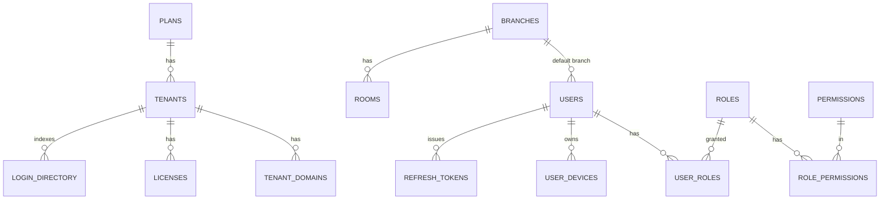
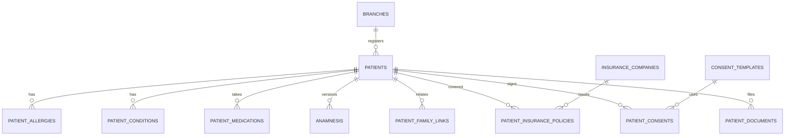
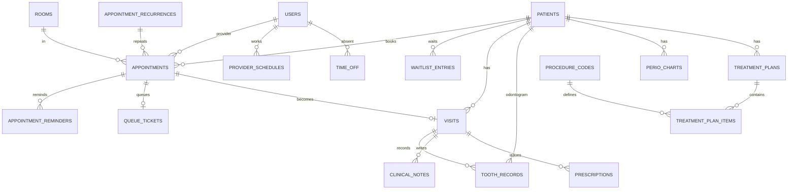
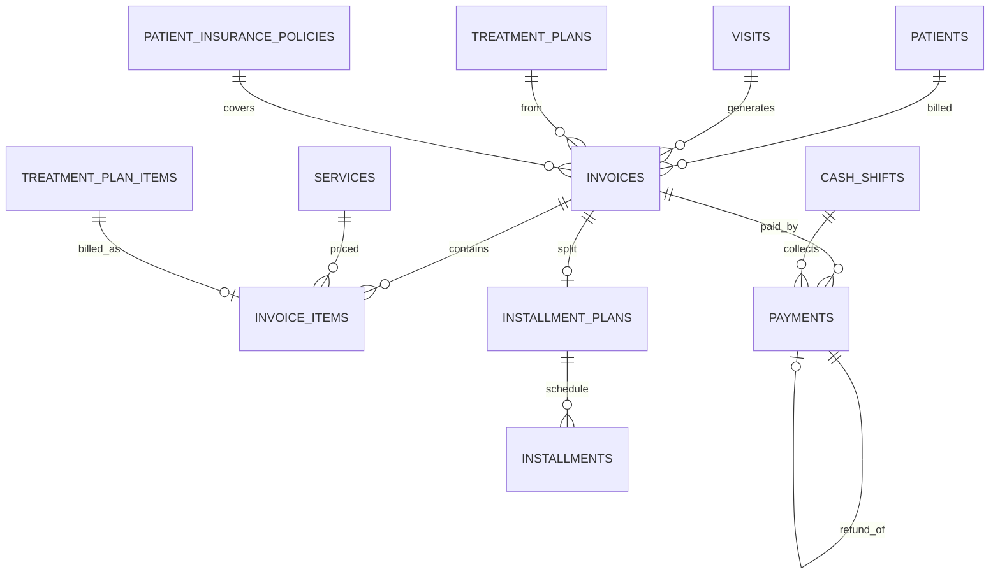
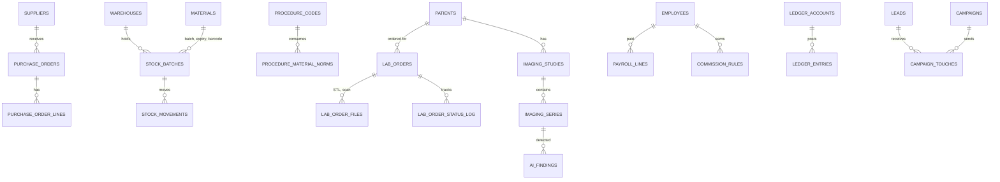

# Mərhələ 2 — Database Design

> Status: ✅ Tamamlandı. Faza 1 sxemi real PostgreSQL 16-da işlədilib və 6 davranış testi keçib (`db/tests.sql`).
> Növbəti: Mərhələ 3 (API Specification)

## 1. Əsas qərarlar

| Mövzu | Qərar |
|---|---|
| Multi-tenancy | `platform` sxemi (ortaq) + hər tenant üçün `t_<slug>` sxemi. Eyni migration skripti hər tenant-a tətbiq olunur (`db/provision.sh`) |
| İkinci qat izolyasiya | `platform.login_directory` üzərində RLS (`app.tenant_id`). Tenant sxemləri ayrı DB rolu ilə yalnız öz `search_path`-ına bağlanır |
| Primary key | `uuid` (`gen_random_uuid()`), klient oflayn yarada bilsin deyə. Pasiyent üçün oxunaqlı `chart_no` ayrıca identity-dir |
| Konkurrensi | Hər mutable cədvəldə `row_version` (trigger ilə artır) → EF Core optimistic concurrency + sync |
| Soft delete | `deleted_at` (pasiyent, sənəd, istifadəçi). Maliyyə və audit heç vaxt silinmir |
| Pul | `numeric(14,2)` + `currency char(3)`. `float` heç yerdə yoxdur |
| Vaxt | Həmişə `timestamptz` (UTC), qəbul müddəti `tstzrange` |
| PHI şifrələməsi | Telefon, email, FİN: AES-256-GCM (`*_enc bytea`) + HMAC blind index (`*_hash`) dəqiq axtarış üçün. Ad/soyad açıqdır (əməliyyat axtarışı, `pg_trgm`), fuzzy axtarış Elasticsearch-dədir. Açarlar KMS-də, tenant üzrə |
| Sync | Əsas cədvəllərdə `change_log` trigger-i: tenant üzrə monoton `seq`. Klient `pull(since=seq)` edir. `users` və `refresh_tokens` sync olunmur |
| Event-lər | `outbox_messages` / `inbox_messages` (exactly-once effekt) |
| Stored procedure | Yalnız zəruri yerdə: trigger-lər (versiya, sync, immutability) və `audit_create_partition` |

## 2. Dəyişməzlik qaydaları (DB səviyyəsində təmin olunur)

| Qayda | Mexanizm |
|---|---|
| Həkimin/otağın qəbulları üst-üstə düşməz | `EXCLUDE USING gist (provider_id WITH =, period WITH &&)` (otaq üçün də). Race condition-a qarşı son müdafiə |
| Ödənişlər dəyişməz | `payments` trigger-i UPDATE/DELETE-i rədd edir. Düzəliş = `kind='refund'` sətri |
| Audit append-only | Trigger + aylıq partition. Hash-chain (`prev_hash`/`hash`) tətbiq qatında hesablanır |
| İmzalanmış klinik qeyd | `signed_at` doludursa dəyişdirmək olmaz, düzəliş = `addendum_of` ilə yeni qeyd |
| Odontoqram tarixçəsi | Yeni qeyd köhnəni `superseded_at` ilə əvəz edir, silinmir |
| Refresh token reuse | `family_id` + `used_at`: istifadə olunmuş token təkrar gəlsə bütün family ləğv edilir |

## 3. ER diaqramları

### 3.1 Platform + Identity


### 3.2 Patient


### 3.3 Scheduling + Clinical


### 3.4 Billing


### 3.5 Faza 2/3 (dizayn səviyyəsində; SQL həmin fazada yazılacaq)

> `LEDGER_ENTRIES` (Accounting) event-sourced, iki tərəfli yazılış (debet = kredit CHECK ilə), append-only.

## 4. Index strategiyası

| Sorğu | Index |
|---|---|
| Pasiyent adı ilə axtarış | GIN `pg_trgm` üzərində `lower(last_name \|\| ' ' \|\| first_name)` (soft-delete olmayanlar) |
| Telefon / FİN ilə dəqiq axtarış | B-tree `phone_hash`, `national_id_hash` (partial: `IS NOT NULL`) |
| Təqvim (filial + zaman aralığı) | GiST `(branch_id, period)` |
| Həkimin günü | B-tree `(provider_id, lower(period))` |
| No-show siyahısı | Partial `WHERE status='no_show'` |
| Göndəriləcək xatırlatmalar | Partial `send_at WHERE status='pending'` |
| Borclar | Partial `invoices(branch_id, due_date) WHERE status IN ('issued','partially_paid')` |
| Aktual odontoqram | Partial `tooth_records(patient_id, tooth_fdi) WHERE superseded_at IS NULL` |
| Outbox poller | Partial `outbox_messages(occurred_at) WHERE processed_at IS NULL` |
| Audit axtarışı | `(entity, entity_id, occurred_at DESC)` və `(user_id, occurred_at DESC)` |

**Qayda:** partial index-lər "isti" məlumat üçün, FK sütunlarının hamısında index var (yuxarıdakılar və əlavə FK index-ləri). Yeni index yalnız `EXPLAIN (ANALYZE, BUFFERS)` ilə əsaslandırılaraq əlavə olunur.

## 5. Partitioning, arxivləşdirmə və saxlama

| Cədvəl | Strategiya |
|---|---|
| `audit_log` | Aylıq RANGE partition (`audit_create_partition`), job hər ay növbətini yaradır. 12 aydan köhnə partition S3-ə (Parquet) arxivlənir, DETACH ilə |
| `change_log` | 30 gündən köhnə sətirlər təmizlənir. Offline klient bundan uzun qalsa tam re-sync |
| `outbox_messages` | İşlənmişlər 7 gündən sonra silinir |
| `payments`, `invoices` | Böyük tenant-larda `paid_at`/`created_at` üzrə illik partition (Faza 2) |
| Fayllar | Yalnız metadata DB-dədir, binar S3-də (lifecycle: 1 ildən sonra cold tier) |

## 6. Əsas sorğuların nümunəsi

```sql
-- Bu gün həkimin təqvimi
SELECT a.id, lower(a.period) AS starts, upper(a.period) AS ends, p.first_name, p.last_name, a.status
FROM appointments a JOIN patients p ON p.id = a.patient_id
WHERE a.provider_id = $1 AND a.period && tstzrange(date_trunc('day', now()), date_trunc('day', now()) + interval '1 day')
ORDER BY lower(a.period);

-- Boş vaxt yoxlaması (rezervasiyadan əvvəl); yekun qərar yenə EXCLUDE constraint-dədir
SELECT NOT EXISTS (SELECT 1 FROM appointments
  WHERE provider_id = $1 AND status IN ('booked','confirmed','checked_in','in_progress') AND period && $2::tstzrange);

-- Borclular
SELECT patient_id, sum(total - paid_total - insurance_amount) AS debt
FROM invoices WHERE status IN ('issued','partially_paid') GROUP BY patient_id HAVING sum(total - paid_total - insurance_amount) > 0;
```

## 7. Fayllar

| Fayl | Məqsəd |
|---|---|
| `db/migrations/platform/P001_platform.sql` | Ortaq sxem: tenant, plan, domen, lisenziya, login_directory + RLS |
| `db/migrations/tenant/T001_common.sql` | Trigger-lər, change_log, outbox/inbox, audit (partitioned) |
| `db/migrations/tenant/T002_identity_org.sql` | Filial, otaq, istifadəçi, RBAC, token, cihaz + seed rollar/icazələr |
| `db/migrations/tenant/T003_patient.sql` | Pasiyent kartı və əlaqəli cədvəllər |
| `db/migrations/tenant/T004_scheduling.sql` | Qəbul, qrafik, xatırlatma, wait list, növbə |
| `db/migrations/tenant/T005_clinical.sql` | Vizit, odontoqram, perio, plan, resept, qeyd |
| `db/migrations/tenant/T006_billing.sql` | Qiymət, invoice, ödəniş, kassa, taksit, gift card, promo |
| `db/migrations/tenant/T007_patient_permissions.sql` | `patient:read_sensitive` icazəsi (Mərhələ 7, Dilim 2) |
| `db/migrations/tenant/T008_clinical.sql` | Prosedur kataloqu, resept override `CHECK`, bir açıq vizit və bir aktual diş qeydi unikal indeksləri, plan bəndi `row_version` (Dilim 4) |
| `db/migrations/tenant/T009_outbox_retry.sql` | `outbox_messages.next_attempt_at` (exponential backoff), gözləyən/işlənmiş sətirlər üçün indekslər (Dilim 5a) |
| `db/migrations/tenant/T010_billing.sql` | Ödəniş qalığı `CHECK`, endirim `CHECK`, vizit başına bir qaralama və plan bəndi başına bir faktura sətri unikal indeksləri, geri qaytarma bağı, issue-dan sonra sətir dəyişməzliyi trigger-i (Dilim 5b) |
| `db/provision.sh` | Tenant sxemi yaradır (idempotent platform, ayrı tranzaksiya hər fayl) |
| `db/tests.sql` | Davranış testləri (double-booking, immutability, versioning) |

Tətbiq (EF Core) tərəfdə bu SQL **mənbə həqiqətidir**: Mərhələ 7-də `DbUp`/`FluentMigrator` runner eyni faylları tenant-lara tətbiq edəcək, EF Core yalnız mapping üçün istifadə olunacaq (schema generasiyası üçün yox). Beləliklə trigger və constraint-lər itmir.

## 8. Məlum məhdudiyyətlər (dürüst qeyd)

- **Düzəliş (Mərhələ 7):** `audit_log.hash` tətbiq qatında yox, **DB-də** hesablanır (jsonb/inet normallaşması səbəbindən). Bax `docs/07-source-code.md`, Dilim 2.
- `refresh_tokens`, `change_log` kimi cədvəllər üçün təmizləmə job-ları Mərhələ 7-də yazılacaq.
- RLS yalnız `platform` sxemində var. Tenant sxemləri `search_path` + ayrı DB rolu ilə izolə olunur. Database-per-tenant (enterprise) üçün eyni skript ayrı DB-yə tətbiq olunur.
- Odontoqram `tooth_records` cədvəli diş-səth qeydlərini saxlayır; 3D model və CBCT annotasiyaları `patient_documents.meta` + Imaging context-i (Faza 3) ilə genişlənəcək.
- İlk versiyada insurance billing yalnız `invoices.insurance_amount` səviyyəsindədir; claim workflow Faza 3-dədir.

> Növbəti: **Mərhələ 3 — API Specification** (OpenAPI 3.1: auth, patient, scheduling, clinical, billing, realtime kontraktları). Davam etmək üçün **"Davam et"** yazın.
