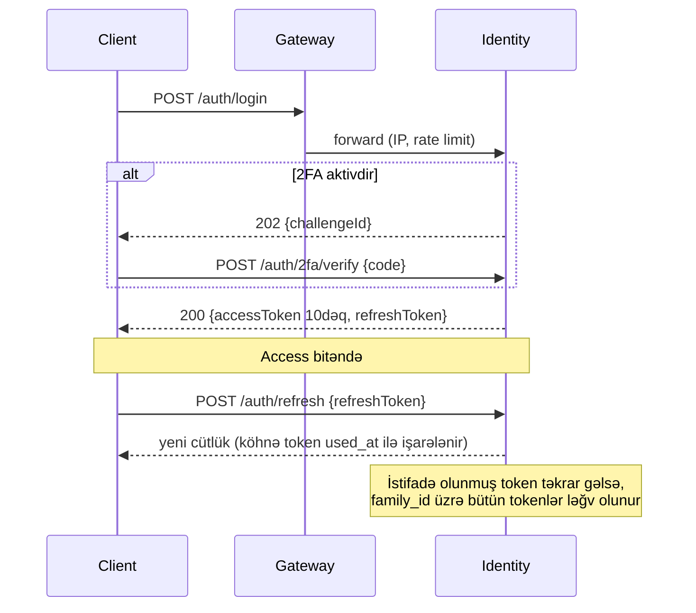
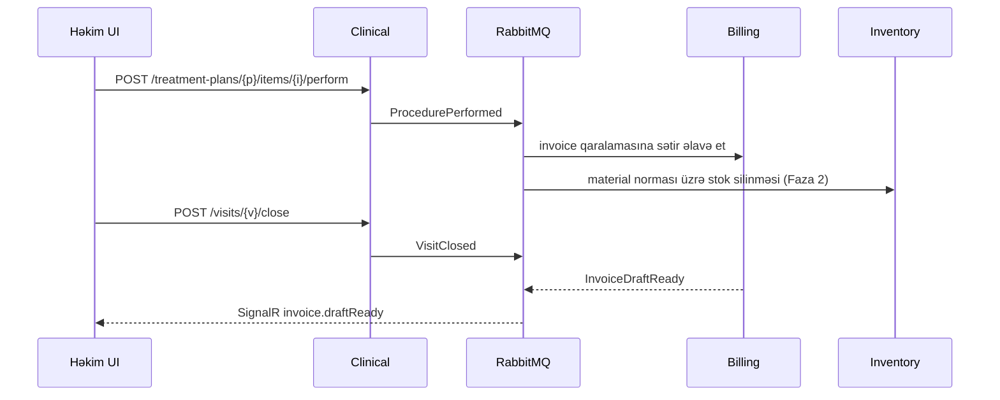

# Mərhələ 3 — API Specification

> Status: ✅ Tamamlandı. `api/openapi.yaml` Redocly ilə validasiya olunub (0 xəta).
> Növbəti: Mərhələ 4 (UI Wireframes)

**Mənbə həqiqət:** `api/openapi.yaml` (OpenAPI 3.1, 46 path, 57 əməliyyat, 43 schema). Mərhələ 7-də server stub-ları və TypeScript/Dart klientləri bu faylın üzərindən generasiya olunacaq, əl ilə yazılmayacaq. Yoxlama: `npx @redocly/cli lint api/openapi.yaml` (`api/redocly.yaml` ilə).

Bu mərhələ **Faza 1** kontraktlarını əhatə edir: Auth, Patient, Scheduling, Clinical, Billing, Dashboard, Sync, Admin. Inventory, Lab, HR, Accounting, CRM, Imaging, AI üçün kontraktlar öz fazalarında əlavə olunacaq.

## 1. Modul → endpoint xəritəsi

| Qrup | Əsas endpoint-lər |
|---|---|
| Auth | `POST /auth/login`, `/auth/2fa/verify`, `/auth/refresh`, `/auth/logout`, `GET /auth/me`, `/auth/sessions` |
| Patients | `GET/POST /patients`, `GET/PATCH/DELETE /patients/{id}`, `/medical-profile`, `/allergies`, `/documents(+/upload-url)`, `/consents` |
| Scheduling | `/appointments` (CRUD, `/availability`, `/check-in`, `/cancel`, `/no-show`), `/queue`, `/waitlist` |
| Clinical | `/visits`, `/visits/{id}/close`, `/patients/{id}/odontogram`, `/patients/{id}/treatment-plans`, `/treatment-plans/{id}/accept`, `/items/{id}/perform`, `/clinical-notes(+/sign)`, `/prescriptions` |
| Billing | `/services`, `/invoices` (+`/issue`, `/pdf`, `/payments`), `/payments/{id}/refund`, `/cash-shifts/open|close` |
| Dashboard | `GET /dashboard/summary` |
| Sync | `GET /sync/pull`, `POST /sync/push` |
| Admin | `/admin/users`, `/admin/audit` |

## 2. Ümumi konvensiyalar

| Mövzu | Qayda |
|---|---|
| Versiya | URL prefiksi `/v1`. Breaking dəyişiklik → `/v2`, köhnəsi üçün `Deprecation` və `Sunset` header-ləri, minimum 6 ay |
| Tenant | Subdomain və JWT `tid` claim uyğun olmalıdır, əks halda 403 |
| Auth | `Authorization: Bearer <jwt>`. Access 10 dəq, refresh 7 gün (rotasiya) |
| İcazə | Hər əməliyyatda `x-permission` var (məs. `invoice:refund`). Server `permissions` claim-ini və scope-u (`own/branch/tenant`) yoxlayır |
| Xətalar | RFC 9457 `application/problem+json` + `code` + `traceId`. Doğrulama xətaları 422, `errors` sahəsi ilə |
| Pagination | Cursor (`cursor`, `limit` ≤ 100), cavab `nextCursor` |
| Concurrency | `PATCH` üçün `If-Match: <rowVersion>`, uyğunsuzluqda **412**. Klient yenidən oxuyub merge edir |
| İdempotentlik | `Idempotency-Key` (yaratma əməliyyatlarında, ödəniş/refund-da **məcburi**). Eyni açar 24 saat eyni cavabı qaytarır |
| Patch | `application/merge-patch+json` (RFC 7396) |
| Vaxt | ISO 8601 UTC, tarix `YYYY-MM-DD` |
| Pul | `number` (2 onluq) + `currency`. Serverdə `decimal`, yuvarlaqlaşdırma bank qaydası ilə |
| Rate limit | Gateway: istifadəçi başına 600/dəq, `/auth/*` üçün IP başına 10/dəq. Header-lər `RateLimit-*`, aşanda 429 + `Retry-After` |
| Gateway-də ümumi cavablar | 401, 403, 429 və 5xx bütün endpoint-lər üçün mümkündür və hər yerdə təkrar yazılmayıb (Redocly `operation-4xx-response` qaydası bu səbəbdən söndürülüb) |
| Fayllar | Binar API-dən keçmir: `upload-url` → S3 pre-signed PUT → `POST /documents` ilə təsdiq. Yükləmə üçün qısa ömürlü GET URL |
| Audit | Pasiyent kartına hər oxuma (`patient.read`) və hər yazma audit-ə düşür, API-də ayrıca addım yoxdur |

## 3. Əsas axınlar

### 3.1 Login + 2FA + refresh rotasiyası

### 3.2 Qəbul yaratma (double-booking qorunması)
1. UI `GET /appointments/availability` ilə slotları göstərir (məsləhət xarakterlidir).
2. `POST /appointments` → handler yazır, DB `EXCLUDE` constraint-i konflikt üçün son hakimdir.
3. Konflikt → **409** `code=appointment.overlap`, UI təqvimi yeniləyir.
4. Uğurlu → `AppointmentBooked` event-i (outbox) → xatırlatmalar planlanır, SignalR `appointment.changed`.

### 3.3 Vizitin bağlanması (saga)

Stok və ya billing uğursuz olarsa kompensasiya: `ProcedureBillingFailed` → həkimə bildiriş, prosedur "icra olunub, faktura gözləyir" statusunda qalır (klinik qeyd itmir).

### 3.4 Ödəniş qaydaları (server tərəfdə)
- Açıq kassa smeni olmadan `cash/pos` qəbul edilmir (422).
- `amount` qalıq borcu aşa bilməz (`billing.overpayment`), artıq məbləğ `prepayment` kimi ayrıca əlavə olunur.
- Refund: yalnız `invoice:refund` icazəsi və rolun `max_amount` limiti daxilində, limiti aşan məbləğ menecer təsdiqi gözləyir.
- Ödəniş dəyişməzdir. Səhv = əks əməliyyat.

### 3.5 Offline sync
- `pull(since=seq)`: `change_log` üzrə dəyişikliklər, səhifələnir (`hasMore`). `since` retention-dan köhnədirsə **410** → tam re-sync.
- `push(changes[])`: hər dəyişiklik `clientChangeId` və `baseVersion` daşıyır. Server `baseVersion = rowVersion` olanı tətbiq edir. Uyğunsuzluqda:
  - append-only data (qeyd, ödəniş, odontoqram qeydi) → `merged`;
  - mutable sahələr → sahə səviyyəsində son yazan qalib (`merged`);
  - klinik həssas sahələr (allergiya, plan statusu) → `needs_manual`, UI-da həll ekranı.
- Sync-ə `users`, `refresh_tokens` daxil deyil.

## 4. Real-time kontraktı (SignalR)

Hub: `wss://{tenant}.dentacore.app/hubs/notifications`. Qoşulma JWT ilə (`access_token` query), qruplar server tərəfdə təyin olunur: `tenant:{tid}`, `branch:{bid}`, `user:{uid}`, `role:{code}`. Backplane: Redis. Klient bağlantı kəsiləndə exponential backoff ilə yenidən qoşulur, sonra `GET`-lə vəziyyəti yeniləyir (event itkisi təhlükəsizdir).

| Event (server → client) | Qrup | Payload |
|---|---|---|
| `appointment.changed` | `branch` | `{id, status, start, end, providerId, roomId, rowVersion}` |
| `queue.updated` | `branch` | `{ticketId, ticketNo, status}` |
| `patient.checkedIn` | `user:{providerId}` | `{patientId, appointmentId}` |
| `invoice.draftReady` | `user:{providerId}` | `{invoiceId, total}` |
| `payment.received` | `role:finance` | `{invoiceId, amount, method}` |
| `dashboard.tick` | `branch` | qismən `DashboardSummary` (≤ 1/5 san, birləşdirilmiş) |
| `alert.stockLow` (Faza 2) | `role:manager` | `{materialId, qty, min}` |
| `session.revoked` | `user` | `{sessionId}`, klient dərhal çıxış edir |

Klient → server: `JoinBranch(branchId)`, `Ack(eventId)` (kritik bildirişlər üçün).

## 5. Inter-service event kontraktları (RabbitMQ)

Exchange: `dental.events` (topic). Routing: `<context>.<event>`. Zərf: `{ id, type, version, tenantId, occurredAt, correlationId, causationId, payload }`. Consumer-lər `inbox_messages` ilə dublikatı atır.

| Event | Producer | Consumer-lər |
|---|---|---|
| `patient.registered` v1 | Patient | Communication (xoş gəldin), CRM, Search indexer |
| `appointment.booked/changed/cancelled/missed` v1 | Scheduling | Communication, Notify, Reporting, AI (no-show) |
| `procedure.performed` v1 | Clinical | Billing, Inventory, HR (komissiya) |
| `visit.closed` v1 | Clinical | Billing |
| `invoice.issued/paid` v1 | Billing | Accounting, Notify, CRM (loyalty) |
| `payment.received/refunded` v1 | Billing | Accounting, Reporting |
| `stock.belowMinimum` v1 (Faza 2) | Inventory | Notify, Purchasing |

Qaydalar: yeni sahə əlavə etmək geriyə uyğundur. Silmək/mənasını dəyişmək → `v2` və paralel dəstək.

## 6. Xəta kodları (nümunə kataloq)

| `code` | HTTP | Mənası |
|---|---|---|
| `auth.invalid_credentials` | 401 | Email/parol səhvdir |
| `auth.account_locked` | 423 | 5 uğursuz cəhddən sonra 15 dəq blok |
| `auth.ip_not_allowed` | 403 | İstifadəçi IP siyasətinə uyğun deyil |
| `permission.denied` | 403 | İcazə və ya scope yoxdur |
| `concurrency.stale` | 412 | `If-Match` köhnədir |
| `patient.duplicate` | 409 | Eyni telefon/FİN ilə pasiyent var (mövcud id qaytarılır) |
| `appointment.overlap` | 409 | Həkim/otaq məşğuldur |
| `appointment.outside_schedule` | 422 | Həkimin iş saatından kənar |
| `clinical.note_signed` | 409 | İmzalanmış qeyd dəyişdirilə bilməz |
| `prescription.allergy_conflict` | 422 | Allergiya ilə ziddiyyət |
| `billing.overpayment` | 422 | Ödəniş borcu aşır |
| `billing.shift_closed` | 422 | Açıq kassa smeni yoxdur |
| `billing.refund_limit` | 403 | Refund limiti aşılıb |
| `sync.full_resync_required` | 410 | `since` köhnədir |

## 7. Məlum məhdudiyyətlər

- Sorğu cavablarının bəzi `200` schema-ları (`/admin/audit`, bəzi `POST` cavabları) hələ yığcamdır, Mərhələ 7-də handler-lərlə birgə dəqiqləşəcək.
- Webhook-lar (online booking, SMS provayder callback-ləri, ödəniş gateway-ləri) Communication və Online Booking modulları ilə birgə Faza 2-də əlavə olunacaq.
- GraphQL və gRPC xarici API kimi verilmir. gRPC yalnız daxili servis çağırışları üçündür.

> Növbəti: **Mərhələ 4 — UI Wireframes** (əsas ekranlar: Dashboard, Təqvim, Pasiyent kartı, Odontoqram, Billing/POS; Material 3 + glassmorphism, dark/light tokenləri). Davam etmək üçün **"Davam et"** yazın.
