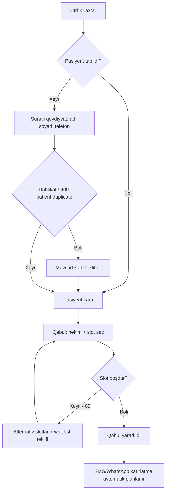
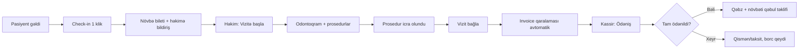
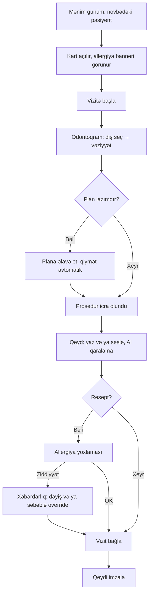
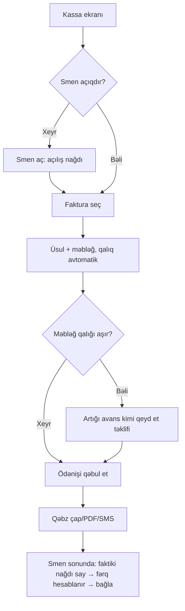
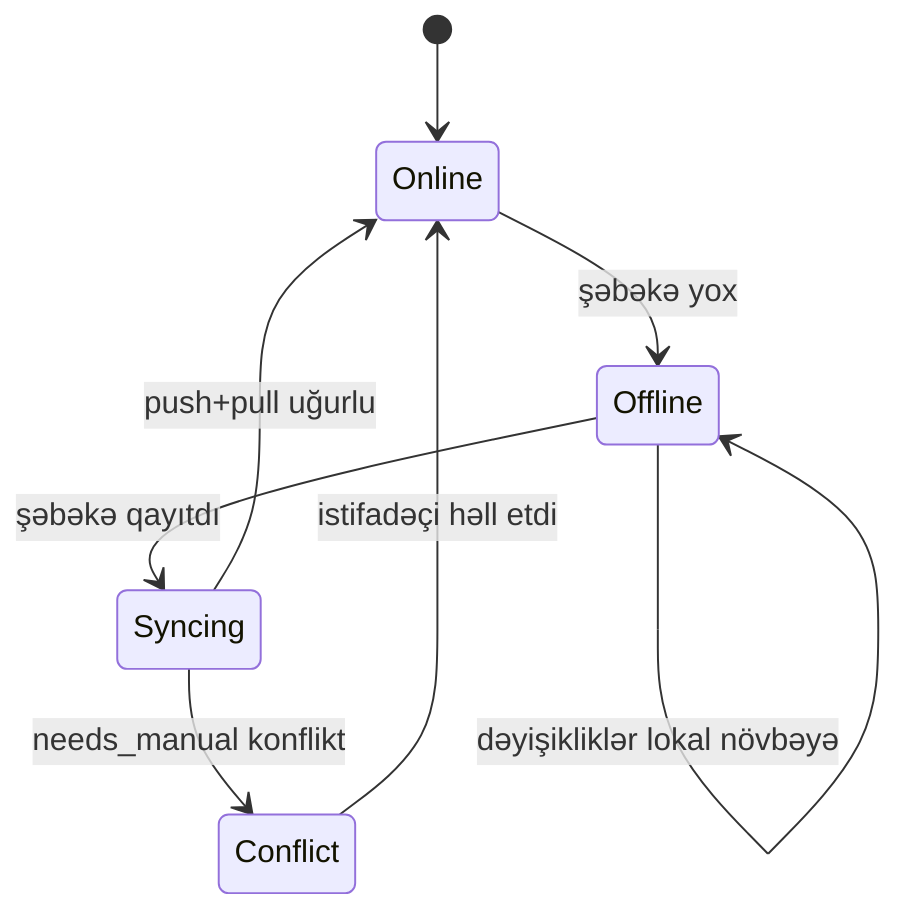

# Mərhələ 5 — UX Flow

> Status: ✅ Tamamlandı. Növbəti: Mərhələ 6 (Folder Structure)

Bu sənəd Mərhələ 3 (API) və Mərhələ 4 (wireframe) ilə uyğundur: hər addım mövcud endpoint və ekrana istinad edir.

## 1. UX prinsipləri

| # | Prinsip | Praktikada |
|---|---|---|
| 1 | **Kontekst daşınır** | Pasiyent bir dəfə seçilir, qəbul, vizit, plan, faktura eyni kontekstdə açılır, yenidən axtarış yoxdur |
| 2 | **Minimal klik** | Hər əsas tapşırığın klik büdcəsi var (bax §3) və CI-də Playwright ilə ölçülür |
| 3 | **Təhlükəsizlik görünür** | Allergiya/risk banneri bağlanmır. Həssas data maskalıdır, açmaq audit yazır |
| 4 | **Heç vaxt data itirmə** | Yarımçıq forma qaralama kimi saxlanır (yerli), offline halda növbəyə düşür |
| 5 | **Rola uyğun sadəlik** | Hər rol yalnız öz işini görür, ilk ekran rola görə dəyişir |
| 6 | **Klaviatura birinci** | Reception və kassir üçün hər şey siçansız mümkündür |
| 7 | **Real-time, amma sakit** | Canlı yeniləmə fokusu oğurlamır. Dəyişən element yumşaq vurğulanır, form yazılarkən yerini dəyişmir |

## 2. Rollar üzrə açılış ekranı və əsas səyahətlər

| Rol | Açılış | Əsas tapşırıqlar |
|---|---|---|
| Reception | Təqvim (bugün) | Axtar, qəbul yarat, check-in, növbə, ilkin ödəniş |
| Həkim | "Mənim günüm" (öz qəbulları + növbədəki pasiyent) | Vizitə başla, odontoqram, plan, qeyd, resept |
| Gigiyenist | "Mənim günüm" | Perio chart, profilaktika qeydi |
| Kassir | Kassa (smen vəziyyəti) | Smen aç, ödəniş, refund sorğusu, smen bağla |
| Maliyyə | Borclar + gəlir | Fakturalar, ödənişlərin uzlaşdırılması |
| Menecer | Dashboard (filial) | Təsdiqlər (refund, endirim), həkim yükü, no-show |
| Direktor | Dashboard (bütün filiallar) | KPI, gəlir, müqayisə |
| Klinik Admin | Tənzimləmələr | İstifadəçilər, otaqlar, qiymət siyahısı, icazə matrisi |
| Super Admin | Platforma konsolu | Tenant, plan, lisenziya, monitorinq |

### 2.1 Reception: yeni pasiyent + qəbul

Qeydiyyat ilkin olaraq yalnız **3 sahə** istəyir (ad, soyad, telefon). Qalanı sonradan, vizit zamanı və ya pasiyentin özü QR/link ilə doldurur.

### 2.2 Gələn pasiyent: check-in → vizit → ödəniş

Bu axın saga ilə (Mərhələ 3 §3.3) işləyir. Həkim faktura haqqında düşünmür, kassir isə hazır qaralama ilə qarşılaşır.

### 2.3 Həkim: vizit

### 2.4 Kassir: smen və ödəniş

Refund: kassir sorğu yaradır. Limit daxilindədirsə dərhal, aşırsa menecerə təsdiq bildirişi gedir (`billing.refund_limit`).

## 3. Klik büdcəsi (qəbul meyarı)

| Tapşırıq | Hədəf | Yol |
|---|---|---|
| Mövcud pasiyentə qəbul yaratmaq | ≤ 4 | `Ctrl K` + ad → kart → "Qəbul" → slot → Saxla |
| Yeni pasiyent + qəbul | ≤ 7 (3 sahə yazmaqla) | Axtar → Yeni → 3 sahə → Saxla → Qəbul → slot |
| Check-in | 1 | Təqvimdə qəbul blokunda "Gəldi" |
| Vizitə başla (qəbuldan) | 1 | "Mənim günüm" kartında "Başla" |
| Diş vəziyyəti qeyd etmək | 3 | Diş → vəziyyət → Saxla (1–9 qısayolları ilə 2) |
| Vizit bağlama + qaralama faktura | 1 | "Vizit bağla" |
| Tam ödəniş | 3 | Faktura → üsul → "Qəbul et" (məbləğ əvvəlcədən dolu) |
| Qəbulu başqa vaxta keçirmək | 1 jest | Sürüklə-burax |
| No-show qeydi | 2 | Blok menyusu → "Gəlmədi" |

Meyar: bu rəqəmlər aşılırsa wireframe/UX yenidən baxılır. İstifadəçi sınaqlarında (hər rol üçün 5 nəfər) vaxt və xəta sayı da ölçüləcək.

## 4. Klaviatura qısayolları

| Qısayol | Əməliyyat | Qeyd |
|---|---|---|
| `Ctrl K` | Qlobal axtarış / əmr paneli | Pasiyent, səhifə, əmr |
| `N` | Yeni qəbul (təqvimdə) | |
| `G` sonra `T/P/B` | Təqvim / Pasiyentlər / Billing | |
| `1–9` | Odontoqramda sürətli vəziyyət | Seçili dişə |
| `Ctrl Z` | Geri al | Odontoqram, qaralama |
| `/` | Cari siyahıda filtr | |
| `?` | Qısayol kömək paneli | |

## 5. Vəziyyətlər: yüklənmə, boş, xəta, offline

| Vəziyyət | Davranış |
|---|---|
| Yüklənmə | Skelet (məzmun formasında), 300 ms-dən sonra göstərilir. Spinner yalnız düymə daxilində |
| Boş | İzahlı mətn + əsas hərəkət düyməsi (məs. "Hələ qəbul yoxdur → Yeni qəbul") |
| Doğrulama xətası (422) | Sahənin yanında inline mesaj, fokus ilk xətalı sahəyə |
| Konflikt (409 overlap) | Toast + təqvim yenilənir, blok əvvəlki yerinə qayıdır, alternativ slotlar təklif olunur |
| Köhnə data (412) | "Bu qeyd başqası tərəfindən dəyişib" dialoqu: **Yenilə** / **Mənim versiyamı saxla (müqayisə ilə)** |
| İcazə yoxdur (403) | Düymə gizlədilir (məlum olandan), əgər link ilə gəlibsə izahlı ekran |
| Sessiya bitdi | Refresh avtomatik. Alınmazsa yazılan data qaralamada saxlanır, giriş ekranı, sonra eyni yerə qayıdış |
| 5xx / şəbəkə | "Yenidən cəhd et" + traceId (dəstək üçün kopyalana bilər) |
| Real-time bağlantı kəsildi | Kiçik "Bərpa olunur…" göstəricisi. Qayıdanda siyahılar yenilənir (Mərhələ 3 §4) |

### 5.1 Offline rejimi (mobil, desktop, PWA)

- Topbar-da həmişə vəziyyət: **● Online / ◌ Offline (N gözləyir) / ⟳ Sinxron / ⚠ Konflikt**.
- Offline işləyən: qəbul baxışı, pasiyent kartı (keşlənmiş), odontoqram, qeyd, nağd ödəniş (lokal qəbz nömrəsi ilə).
- Offline **işləməyən**: SMS/WhatsApp göndərmə, AI funksiyaları, kart ödənişi, yeni istifadəçi dəvəti. Bu düymələr izahla deaktivdir ("Şəbəkə lazımdır").
- Konflikt ekranı: iki sütun ("Sizin" / "Serverdə"), sahə-sahə seçim. Yalnız klinik həssas sahələr (allergiya, plan statusu) üçün çıxır, qalanı avtomatik birləşir.
- 72 saatdan uzun offline: tam re-sync xəbərdarlığı.

## 6. Onboarding

**Yeni klinika (Klinik Admin, ~10 dəq hədəf):**
1. Klinika məlumatı (ad, ölkə, valyuta, saat qurşağı).
2. Filial və kabinetlər.
3. Həkimlər və iş qrafiki (CSV/Excel idxal və ya əl ilə).
4. Qiymət siyahısı: şablon seç (Azərbaycan/ümumi) və ya Excel idxal.
5. Rolları təyin et və dəvətlər göndər.
6. İsteğe bağlı: köhnə sistemdən pasiyent idxalı (CSV, dublikat yoxlaması ilə).

Hər addım atlana bilər, yarımçıq addımlar "Qurulum" kartında qalır (progress faizi). Sandbox/demo data ilə "Gəzinti" rejimi var.

**Yeni istifadəçi:** dəvət e-poçtu → parol + 2FA qur → rola uyğun 3 addımlıq tur. Tur yalnız bir dəfə, "Köməyi yenidən göstər" ilə təkrarlanır.

**Pasiyentin onlayn qeydiyyatı (QR/link):** ad, telefon, doğum tarixi, allergiya, razılıq və e-imza. Nəticə reception-a "təsdiq gözləyir" kimi düşür.

## 7. Mobil və tablet (Faza 2)

- Alt naviqasiya (5 element): Bu gün, Təqvim, Pasiyentlər, Bildirişlər, Daha çox.
- Həkim tablet rejimi: odontoqram tam ekran, böyük toxunma hədəfləri (≥ 48 px), qələm dəstəyi (annotasiya).
- Biometrik giriş (Face ID/barmaq izi), qısa PIN ilə yenidən kilidləmə (şərt: sessiya aktivdir, cihaz etibarlıdır).
- Push bildirişləri: yalnız fəaliyyət tələb edənlər (pasiyent gəldi, təsdiq gözləyir). Səs-küyü azaltmaq üçün qruplaşdırılır.

## 8. Mətn, dil və format

- Dillər: AZ (default), EN, RU, TR. Mətnlər açar əsaslıdır, hardcode yoxdur. Mətn uzunluğu 40% artsa da layout pozulmamalıdır.
- Tarix/saat və pul formatı tenant lokalına görə (`Intl`).
- Səhv mesajları: nə oldu + nə etməli (məs. "Bu saatda Dr. Həsənov məşğuldur. 14:30 və 15:00 boşdur."). Texniki kod yalnız detalda.
- Boş vəziyyət və təsdiq mətnləri qısa, hərəkət feili ilə ("Qəbul yarat", "Saxla"), "OK/Bəli" yox.

## 9. Təhlükəsizlik UX-i

- İkinci faktor tələbi: yeni cihaz, həssas əməliyyat (refund, istifadəçi icazəsi dəyişmə, data export) üçün təkrar təsdiq.
- "Break-glass": icazəsi olmayan pasiyentə təcili baxış → səbəb yazılır → audit + menecerə bildiriş.
- İnaktivlik: 15 dəq sonra ekran kilidi (klinik tenant-da konfiqurasiya olunur), qaralamalar itmir.
- Uzaq sessiya ləğvi (Mərhələ 3 `session.revoked`) klientdə dərhal kilid ekranı açır.

## 10. Ölçmə və qəbul meyarları

| Metrik | Hədəf |
|---|---|
| Yeni reception istifadəçisi ilk qəbulu özü yaradır | < 5 dəq, təlimsiz |
| Task success rate (kritik axınlar) | ≥ 95% |
| Ortalama xəta/yanlış klik (qəbul yaratma) | ≤ 0.3 |
| SUS balı | ≥ 80 |
| Odontoqram əməliyyat gecikməsi | < 100 ms |
| E2E klik büdcəsi testləri | CI-də yaşıl |

Yoxlama planı: Mərhələ 8-də klik büdcəsi və əsas axınlar üçün Playwright E2E testləri, Mərhələ 4 wireframe-ləri ilə istifadəçi sınağı (hər rol üçün 5 nəfər, düşünərək danış metodu).

## 11. Məlum boşluqlar

- Super Admin platforma konsolu, hesabat konstruktoru, CRM kampaniya axınları, lab sifarişi və implant/ortodontik planlama axınları öz fazalarında çəkiləcək.
- Konflikt həlli ekranının wireframe-i hələ yoxdur (Mərhələ 7-də Sync ilə birgə).
- Pasiyent portalı (özünə xidmət) yalnız onlayn qeydiyyat səviyyəsində planlaşdırılıb.

> Növbəti: **Mərhələ 6 — Folder Structure**: monorepo, hər servisin Clean Architecture qovluqları, frontend, mobil, desktop, infra, test və CI strukturu. Davam etmək üçün **"Davam et"** yazın.
