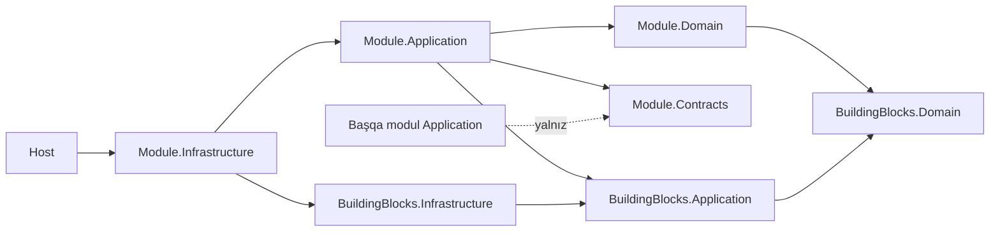

# Mərhələ 6 — Folder Structure

> Status: ✅ Tamamlandı. Backend skeleti 42 layihə ilə qurulub, `dotnet build` (0 xəta, 0 xəbərdarlıq) və 7 arxitektura testi keçir.
> Növbəti: Mərhələ 7 (Source Code)

## 1. Qərar: monorepo + modul-əsaslı backend

Bir repozitoriya (monorepo): backend, frontend, mobil, infra və sənədlər birlikdə versiyalanır, API kontraktı dəyişəndə klientlər eyni PR-da yenilənir.

Backend **modular monolith-ready** yazılır (Mərhələ 1, ADR-001): hər Bounded Context ayrıca "Module"-dur (öz Domain/Application/Infrastructure/Contracts layihələri). Deploy vahidi isə **Host** layihəsidir və bir neçə modulu birləşdirə bilər. Trafik artanda modul ayrı host-a çıxarılır, kodu dəyişmir, yalnız yeni host layihəsi əlavə olunur.

## 2. Ağac (xülasə)

```
dental-erp/
├─ api/                      OpenAPI 3.1 kontraktı (Mərhələ 3), mənbə həqiqət
├─ db/                       SQL miqrasiyaları (platform + tenant), provision.sh, tests.sql (Mərhələ 2)
├─ docs/                     00..10 mərhələ sənədləri, adr/
├─ ui/wireframes/            Mərhələ 4 prototipləri
├─ backend/
│  ├─ DentaCore.sln
│  ├─ Directory.Build.props  ortaq qaydalar (net9.0, Nullable, TreatWarningsAsErrors, analizatorlar)
│  ├─ Directory.Packages.props  mərkəzi paket versiyaları (Central Package Management)
│  ├─ global.json            SDK pin
│  ├─ src/
│  │  ├─ BuildingBlocks/
│  │  │  ├─ DentaCore.BuildingBlocks.Domain/          Entity, AggregateRoot, ValueObject, DomainEvent, Result
│  │  │  ├─ DentaCore.BuildingBlocks.Application/     CQRS abstraksiyaları, pipeline behavior-lar
│  │  │  └─ DentaCore.BuildingBlocks.Infrastructure/  Outbox/Inbox, tenant resolver, EF baza sinifləri
│  │  ├─ Modules/            (hər biri: .Contracts .Domain .Application .Infrastructure)
│  │  │  ├─ Identity/  Tenancy/  Patient/  Scheduling/  Clinical/  Billing/  Audit/  Sync/
│  │  └─ Hosts/              deploy vahidləri
│  │     ├─ DentaCore.Gateway/         YARP API Gateway
│  │     ├─ DentaCore.Identity.Api/    Identity + Tenancy + Audit
│  │     ├─ DentaCore.ClinicCore.Api/  Patient + Scheduling + Clinical + Sync
│  │     ├─ DentaCore.Billing.Api/     Billing
│  │     ├─ DentaCore.Notify.Api/      SignalR hub
│  │     └─ DentaCore.Workers/         Outbox publisher, xatırlatma, audit partition job-ları
│  └─ tests/
│     └─ DentaCore.Architecture.Tests/   qat və modul sərhədi qaydaları
├─ frontend/                 pnpm workspace: apps/web (Next.js), packages/{ui, api-client, config}
├─ mobile/dentacore_mobile/  Flutter (Faza 2)
├─ desktop/                  .NET MAUI (Faza 3)
├─ infra/                    docker, k8s (Kustomize), helm, terraform, observability, backup
├─ e2e-tests/                Playwright (Mərhələ 8)
└─ scripts/                  developer skriptləri
```

Faza 2/3 modulları (Inventory, Laboratory, HR, Accounting, CRM, Imaging, Communication, Reporting, AI) eyni şablonla `Modules/` altına əlavə olunur və arxitektura testləri onlara avtomatik tətbiq olunur.

## 3. Modul → Host xəritəsi

| Host | Modullar | Qeyd |
|---|---|---|
| `Identity.Api` | Identity, Tenancy, Audit | Auth sərhədi ayrıdır |
| `ClinicCore.Api` | Patient, Scheduling, Clinical, Sync | Sıx əlaqəli, ortaq tranzaksiya imkanı |
| `Billing.Api` | Billing | Maliyyə konsistensiyası ayrıdır |
| `Workers` | Scheduling, Billing, Audit | Fon işləri (xatırlatma, outbox, partition) |
| `Notify.Api` | (modul yoxdur) | SignalR bağlantıları, yalnız event consumer |
| `Gateway` | (modul yoxdur) | Marşrutlaşdırma, JWT, rate limit, tenant resolve |

Bu xəritə Mərhələ 1 §3 ilə eynidir. Host-un `csproj`-u modulun yalnız `.Infrastructure` layihəsinə istinad edir.

## 4. Asılılıq qaydaları



| # | Qayda | Yoxlanır |
|---|---|---|
| 1 | `Domain` yalnız `BuildingBlocks.Domain`-ə istinad edir, **heç bir NuGet paketi yoxdur** (EF, ASP.NET, MediatR yoxdur) | `Domain_depends_only_on_BuildingBlocks_Domain_and_has_no_packages` |
| 2 | `Application` `Infrastructure`, `Api` və `Workers`-ə istinad etmir | `Application_never_references_Infrastructure_or_Hosts` |
| 3 | Modullar bir-biri ilə **yalnız `.Contracts`** vasitəsilə danışır (integration event, sorğu interfeysləri) | `Modules_talk_to_each_other_only_through_Contracts` |
| 4 | `Contracts` heç bir layihəyə istinad etmir (təmiz DTO və event-lər, semantik versiya) | `Contracts_have_no_project_dependencies` |
| 5 | Host yalnız modulun `Infrastructure` layihəsinə istinad edir (kompozisiya kökü) | `Hosts_reference_only_module_Infrastructure_projects` |
| 6 | `BuildingBlocks.Domain` heç nəyə bağlı deyil | `BuildingBlocks_Domain_has_no_dependencies` |

Testlər `.csproj` ProjectReference qrafını oxuyur. Boş layihələrdə də işləyir (kompilyator istifadə olunmayan referansı assembly-dən silir, ona görə assembly əsaslı yoxlama etibarsız olardı). Mərhələ 7-də kod gələndən sonra tip səviyyəsində qaydalar (məs. Domain-də `DbContext` yoxdur) NetArchTest ilə əlavə olunacaq.

**Yoxlama:** `Patient.Application`-a qəsdən `Billing.Domain` və `Patient.Infrastructure` referansı əlavə etdim. İki qayda (2 və 3) qırmızı oldu, geri qaytardım, yenə yaşıldır.

## 5. Layihə daxili şablon (Mərhələ 7-də doldurulacaq)

```
Module.Domain/            Aggregates/  ValueObjects/  Events/  Specifications/  Abstractions/ (IRepository)
Module.Application/       Commands/<UseCase>/{Command, Handler, Validator}  Queries/<UseCase>/{Query, Handler}
                          Abstractions/  DependencyInjection.cs
Module.Infrastructure/    Persistence/{Configurations, Repositories, ReadModels}  Messaging/{Consumers, Outbox}
                          Search/ (Elasticsearch)  Storage/ (S3)  DependencyInjection.cs
Module.Contracts/         IntegrationEvents/  Queries/ (başqa modullar üçün)
Hosts/*/                  Program.cs  Endpoints/<Module>/  Middleware/  appsettings*.json
```
Hər use case bir qovluqdur ("vertical slice" Application daxilində). Endpoint-lər Host-dadır və yalnız MediatR-a göndərir, biznes məntiqi yoxdur.

## 6. Adlandırma və konvensiyalar

| Mövzu | Qayda |
|---|---|
| Namespace | Layihə adı ilə eynidir: `DentaCore.Patient.Domain` |
| Layihə adı | `DentaCore.<Module>.<Layer>`, host: `DentaCore.<Host>` |
| Command/Query | `RegisterPatientCommand`, `GetPatientByIdQuery`, handler `...Handler` |
| Domain event | Keçmiş zaman: `PatientRegistered`; integration event: `PatientRegisteredV1` (`Contracts`-da) |
| Fayl | Bir tip bir fayl, file-scoped namespace (`.editorconfig` ilə məcburi) |
| Test layihəsi | `DentaCore.<Module>.UnitTests`, `DentaCore.<Module>.IntegrationTests` (Mərhələ 8) |
| Paket versiyası | Yalnız `Directory.Packages.props`-da (CPM) |
| Frontend | `features/<modul>/{components,hooks,api}`, ümumi kod `shared/` |
| Branch/commit | Trunk-based, qısa branch-lər, Conventional Commits (Mərhələ 9 CI qaydaları ilə) |

## 7. Keyfiyyət qapıları (artıq aktivdir)

- `TreatWarningsAsErrors` + `AnalysisLevel=latest-recommended`: analizator xəbərdarlığı build-i sındırır. Test layihələrində yalnız CA1707 (test adında underscore) söndürülüb.
- `EnforceCodeStyleInBuild`: `.editorconfig` qaydaları build-də tətbiq olunur.
- `global.json`: SDK pin (`9.0.100`, `rollForward: latestMajor`).
- `.gitignore`: `bin/`, `obj/`, `node_modules/`, `.env*` (yalnız `.env.example` yoxlanılır), açar/sertifikat faylları.

## 8. Məlum məhdudiyyətlər (dürüst qeyd)

- Bu mühitdə yalnız .NET **SDK 10** quraşdırmaq mümkün oldu (apt). Layihələr `net9.0` hədəfləyir və kompilyasiya olunur, testlər isə .NET 9 runtime-ı olmadığından `DOTNET_ROLL_FORWARD=Major` ilə .NET 10 üzərində işləyir. CI-də (Mərhələ 9) real .NET 9 SDK/runtime işlədilməlidir.
- Frontend, Flutter və MAUI üçün yalnız qovluq və konfiqurasiya razılaşması var. Onlar hələ qurulmayıb/yoxlanılmayıb (`pnpm install`, `flutter create` Mərhələ 7 və Faza 2/3).
- `db/` kökdə qalır (SQL mənbə həqiqətdir, Mərhələ 2 §7). Miqrasiya runner-i Mərhələ 7-də `Tenancy` modulu ilə əlavə olunacaq.
- 42 layihənin çoxu hələ boşdur, bu qəsdəndir: struktur və qaydalar əvvəlcə təsdiqlənir, sonra vertikal dilimlər əlavə olunur.

> Növbəti: **Mərhələ 7 — Source Code.** Böyük mərhələdir, hissə-hissə gedəcək. Təklif olunan ilk dilim: BuildingBlocks (Entity, AggregateRoot, Result, CQRS pipeline, Outbox) + Identity (login, JWT, refresh rotasiya) + unit/integration testləri. Davam etmək üçün **"Davam et"** yazın.
